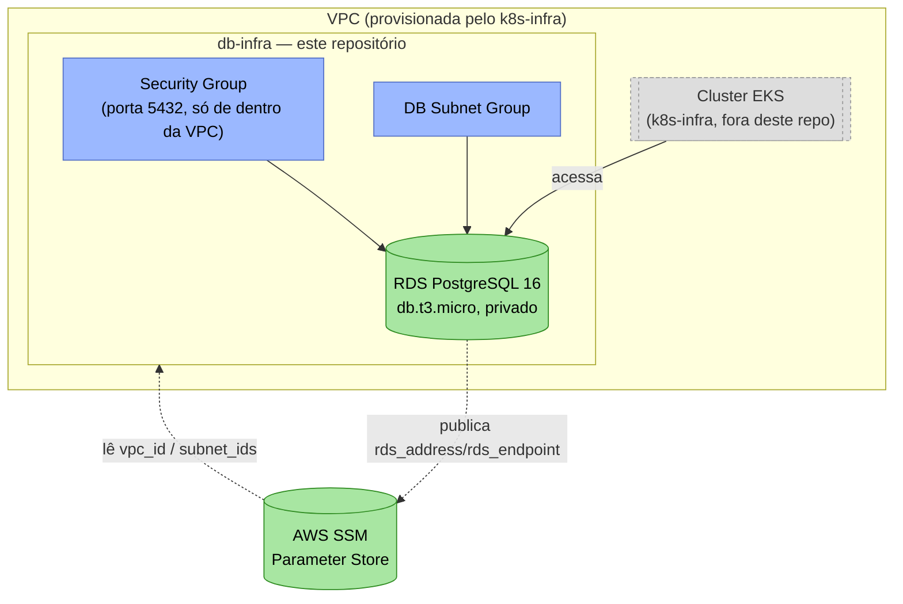

# db-infra

Infraestrutura do banco de dados gerenciado (Terraform) do projeto **Oficina Mecânica** — Fase 3 do Tech Challenge FIAP.

Provisiona a instância RDS PostgreSQL usada pela aplicação principal (repositório [`api`](https://github.com/FIAP-15SOAT-GabrielHelton/api)).

Este repositório faz parte de um conjunto de 5 (arquitetura completa na [RFC-001](https://github.com/FIAP-15SOAT-GabrielHelton/api/blob/main/docs/fase3/RFC-001-authentication-authorization-serverless.md) do repo `api`):

| Repositório | Responsabilidade |
| :--- | :--- |
| [`k8s-infra`](https://github.com/FIAP-15SOAT-GabrielHelton/k8s-infra) | VPC + EKS + node group |
| `db-infra` (este repo) | RDS PostgreSQL |
| [`api`](https://github.com/FIAP-15SOAT-GabrielHelton/api) | Aplicação Rails + ECR + deploy no cluster |
| [`auth-serverless`](https://github.com/FIAP-15SOAT-GabrielHelton/auth-serverless) | API Gateway + Lambdas de autenticação/RBAC |
| [`deploy-orchestrator`](https://github.com/FIAP-15SOAT-GabrielHelton/deploy-orchestrator) | Dispara e aguarda o deploy dos 4 repos acima, em ordem |

## Tecnologias utilizadas

| Categoria | Tecnologia |
| :--- | :--- |
| IaC | Terraform (`hashicorp/aws` ~> 5.0) |
| Nuvem | AWS RDS (PostgreSQL 16), Security Group, DB Subnet Group |
| CI/CD | GitHub Actions (`workflow_dispatch`) |
| Backend do state | S3 (bucket compartilhado com os demais repositórios, key própria) |

## Arquitetura



- **Security Group** (`infra/rds.tf`): libera PostgreSQL (`5432`) só de dentro da VPC (lida via SSM, publicada pelo `k8s-infra`) — o RDS nunca é público.
- **DB Subnet Group**: usa as subnets públicas do `k8s-infra` (o RDS em si não é acessível de fora, apesar de estar em subnet pública — controlado pelo Security Group e por `publicly_accessible = false`).
- **Instância RDS**: PostgreSQL 16, `db.t3.micro`, 20-100 GB (autoscaling de storage).

## Dependências

Lê do SSM Parameter Store (publicados pelo `k8s-infra`, que precisa ser implantado primeiro):

| Parâmetro | Uso |
| :--- | :--- |
| `/oficina-mecanica/vpc_id` | VPC onde o RDS e seu Security Group são criados |
| `/oficina-mecanica/subnet_ids` | Subnets do DB Subnet Group |

## Parâmetros publicados

| Parâmetro | Valor | Consumido por |
| :--- | :--- | :--- |
| `/oficina-mecanica/rds_address` | Address do RDS PostgreSQL | `api` |
| `/oficina-mecanica/rds_endpoint` | Endpoint (`host:porta`) do RDS PostgreSQL | `api` |

## Execução local

Não há aplicação para "rodar" — apenas o Terraform pode ser validado localmente (o `apply` real exige uma sessão AWS Academy ativa e o `k8s-infra` já implantado):

```bash
cd infra/
terraform init -backend=false   # sem backend, só para validar/formatar localmente
terraform validate
terraform fmt -check
```

Para um `plan` completo (exige credenciais AWS válidas, o backend S3 e o `k8s-infra` já implantados):

```bash
terraform init \
  -backend-config="bucket=<nome-do-bucket-s3>" \
  -backend-config="key=oficina-mecanica/db-infra.tfstate" \
  -backend-config="region=us-east-1"

TF_VAR_db_password=<senha> terraform plan
```

## Configuração necessária

Secret do repositório: `DB_PASSWORD` (senha do usuário `postgres` do RDS).

## Deploy

Workflow `CD Deploy (RDS PostgreSQL)` (`workflow_dispatch`), recebendo as credenciais temporárias da sessão do AWS Academy.

**Ordem de deploy do projeto**: `k8s-infra` → `db-infra` (este repo) → `api` → `auth-serverless` (ou use o [`deploy-orchestrator`](https://github.com/FIAP-15SOAT-GabrielHelton/deploy-orchestrator)).

## Destroy

Workflow `CD Destroy (RDS PostgreSQL)`. Deve rodar **depois** do destroy do `api` e **antes** do destroy do `k8s-infra`.

## Documentação da API

Este repositório não expõe nenhuma API HTTP — é infraestrutura pura. A documentação da API do projeto (Swagger/OpenAPI) vive no repositório [`api`](https://github.com/FIAP-15SOAT-GabrielHelton/api#documenta%C3%A7%C3%A3o-da-api).
